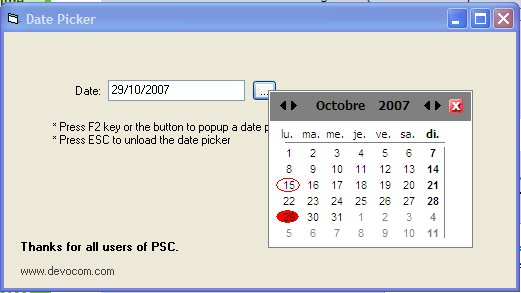



## Date picker

### Description

See the screenshot. You can use this date picker easily in your forms without ocx. It's recommended to use the minimum of ocx because of deployement of your application.
 
### More Info
 

             |
---                |---
**Submitted On**   |2007-10-29 07:20:02
**By**             |[Fares Hanini](https://github.com/Planet-Source-Code/PSCIndex/blob/master/ByAuthor/fares-hanini.md)
**Level**          |Beginner
**User Rating**    |4.7 (14 globes from 3 users)
**Compatibility**  |VB 5\.0, VB 6\.0
**Category**       |[Custom Controls/ Forms/  Menus](https://github.com/Planet-Source-Code/PSCIndex/blob/master/ByCategory/custom-controls-forms-menus__1-4.md)
**World**          |[Visual Basic](https://github.com/Planet-Source-Code/PSCIndex/blob/master/ByWorld/visual-basic.md)
**Archive File**   |[Date\_picke20888210292007\.zip](https://github.com/Planet-Source-Code/fares-hanini-date-picker__1-69556/archive/master.zip)

